# OAuth 2 Open ID Connect using Defra ID

## Component Overview

```mermaid
graph LR
    subgraph FEATURES["🔌 PLUGIN: 'auth-routes'<br/>src/server/auth/"]
        AuthRoutes[index.js<br/>Login/Callback/Logout]
    end

    subgraph EXT["External Schemes<br/>@hapi/*"]
        Bell[bell<br/>OAuth2]
        Cookie[cookie<br/>Session]
        JWT[jwt<br/>Token Utils]
    end

    subgraph INFRA["🔌 PLUGIN: 'auth'<br/>src/plugins/auth/"]
        AuthPlugin[auth.js<br/>Register schemes<br/>Configure strategies]
        Strategy[defra-id-strategy.js<br/>Bell Provider]
    end

    %% Infrastructure uses external schemes
    Bell --> AuthPlugin
    Cookie --> AuthPlugin
    JWT --> AuthPlugin
    JWT --> Strategy

    %% Infrastructure internal
    Strategy --> AuthPlugin

    %% Features depend on infrastructure
    AuthPlugin --> AuthRoutes

    %% Features use JWT
    JWT --> AuthRoutes

    style AuthRoutes fill:#fff4e1,stroke:#cc6600,stroke-width:3px
    style AuthPlugin fill:#e1f5ff,stroke:#0066cc,stroke-width:3px
    style Strategy fill:#e1f5ff
    style Bell fill:#e8f4f8
    style Cookie fill:#e8f4f8
    style JWT fill:#e8f4f8
```



## Two Separate Auth Plugins

### Infrastructure vs Features

The directory structure follows Hapi's plugin philosophy of composable, single-purpose modules:

- **src/plugins/** = Infrastructure plugins (strategies, session, CSRF, router)
- **src/server/** = Feature plugins (routes organized by domain)

This separation allows feature plugins to be minimal, focused on business logic, while infrastructure plugins handle cross-cutting concerns.

### We have TWO separate auth plugins:

- Plugin name: `'auth'` **src/plugins/auth.js**, registered In main plugins array (src/plugins/index.js). This plugin is **infrastructure**. It registers authentication schemes (Bell, Cookie) and configures authentication strategies ('defra-id', 'session').
- Plugin name: `'auth-routes'` **src/server/auth/index.js**, registered: Inside the router plugin (src/plugins/router.js line 43). This plugin is **features**. It registers authentication routes (login, callback, logout).

## Schemes vs Strategies

**Important distinction:**

- **Bell and Cookie are schemes** - they provide the authentication interface/implementation
- **'defra-id' and 'session' are strategies** - they are configured instances of those schemes

The `'auth'` plugin uses this pattern:

```javascript
await server.register([Bell, Cookie, jwt]) // Registers SCHEMES
server.auth.strategy('defra-id', 'bell', options) // Configures a STRATEGY using the 'bell' scheme
server.auth.strategy('session', 'cookie', options) // Configures a STRATEGY using the 'cookie' scheme
```

A **scheme** is the plugin that provides the authentication mechanism. A **strategy** is a named, configured instance of that scheme that routes can reference.

The `'auth-routes'` plugin then uses these strategies in its route definitions (e.g., `auth: { strategy: 'defra-id' }`).

## Infrastructure vs Features

The directory structure follows Hapi's plugin philosophy of composable, single-purpose modules:

- **src/plugins/** = Infrastructure plugins (strategies, session, CSRF, router)
- **src/server/** = Feature plugins (routes organized by domain)

This separation allows feature plugins to remain thin, focused on business logic, while infrastructure plugins handle cross-cutting concerns.

## Directory Structure & Component Responsibilities

```
src/
├── plugins/                    ← INFRASTRUCTURE
│   ├── auth.js                 ← 'auth' plugin: Registers schemes, configures strategies
│   ├── auth/
│   │   └── defra-id-strategy.js ← Bell provider configuration for DEFRA ID
│   ├── session.js              ← Session cache (Yar/Redis)
│   ├── csrf.js                 ← CSRF protection
│   └── router.js               ← Route aggregator
│
├── server/                     ← FEATURES (route bundles)
│   ├── auth/
│   │   └── index.js            ← 'auth-routes' plugin: Login/callback/logout routes
│   ├── dashboard/
│   │   └── index.js            ← Dashboard routes plugin
│   └── examples/
│       └── index.js            ← Examples routes plugin
│
└── auth/                       ← UTILITIES (framework-agnostic)
    ├── oidc-well-known-discovery.js ← OIDC endpoint discovery
    └── refresh-tokens.js       ← Token refresh logic
```

- **src/plugins/** contains infrastructure that other parts of the app depend on (strategies, session, CSRF)
- **src/server/** contains feature plugins organized by domain (authentication, dashboard, examples)
- **src/server/common/helpers/** contains Hapi-specific utilities (session-helpers wraps Yar)
- **src/auth/** contains pure utilities with no Hapi dependencies (portable, testable)
- **src/plugins/auth/** contains Hapi-specific auth configuration (Bell provider setup)

This is trying to follow Hapi's plugin philosophy: composable, single-purpose modules. Infrastructure and features are clearly separated.

### Auth Plugin (Infrastructure)

**Location:** src/plugins/auth.js

- Registers authentication schemes: `@hapi/bell`, `@hapi/cookie`, and `@hapi/jwt` plugins
- Configures two authentication strategies:
  - `'defra-id'` strategy using the 'bell' scheme (OAuth2/OIDC)
  - `'session'` strategy using the 'cookie' scheme (session validation)
- Implements custom `validate` function for automatic token refresh

**Design decision:**
Token refresh happens in the Cookie strategy's `validate` function rather than in route handlers. This makes token refresh transparent to application code - routes just check `request.auth.isAuthenticated` and get fresh tokens automatically.

Configuration includes `appendNext: true` to preserve the original requested URL through the OAuth flow, following Hapi's convention for redirect-based authentication.

### DEFRA ID Bell Provider Configuration

**Location:** src/plugins/auth/defra-id-strategy.js

- Exports `getDefraIdStrategy()` function that returns a custom Bell provider configuration for DEFRA ID.
- Lives in `src/plugins/auth/` (not `src/auth/`) because it's Hapi-specific configuration for the Bell scheme. It's tightly coupled to the `@hapi/bell` plugin API.

**Bell**

- **Custom Bell provider**: Bell allows custom OAuth providers via configuration objects
- **Profile extraction callback**: `profile` function is called by Bell after token exchange to extract user data from ID token
- **Provider params callback**: `providerParams` function adds DEFRA-specific parameters (service_id, login_hint) to OAuth authorization requests

**Design decisions:**

1. **Custom provider necessary**: DEFRA ID is not a built-in Bell provider, so we define authorization/token endpoints manually
2. **JWT decode without validation**: We decode the ID token to extract user profile but don't validate signatures because tokens come directly from DEFRA ID's token endpoint over HTTPS
3. **Login hint preservation**: `providerParams` passes through `login_hint` query parameter to support cross-system SSO

### Auth Routes Plugin (Features)

**Location:** src/server/auth/index.js

- Defines authentication routes (`/auth/login`, `/auth/callback`, `/auth/logout`) and exports them as a Hapi plugin named `'auth-routes'`.
- Lives in `src/server/` (not `src/plugins/`) because it's a feature plugin that defines business logic (authentication flow), not infrastructure. Routes are organized by domain in `src/server/`.
- **Plugin pattern**: Routes bundled into a reusable plugin
- **Strategy application**: Routes use `auth: { strategy: 'defra-id', mode: 'try' }` to apply Bell OAuth
- **Session storage**: Uses session-helpers abstraction (`setSessionValue`, `clearSessionValue`, `getSessionValue`) for server-side session data

**Design decision:**
Plugin is named `'auth-routes'` (not `'auth'`) to avoid collision with the infrastructure auth plugin. This naming makes the separation of concerns explicit.

Routes follow Hapi's convention of minimal logic - they orchestrate calls to strategies and utilities but don't implement authentication logic themselves.

## Plugin Registration Order & Dependencies

```javascript
// src/plugins/index.js
export const plugins = [
  session, // Must register BEFORE auth (Cookie strategy needs Yar)
  auth // Infrastructure: Registers strategies
  // ... other plugins
]

// src/plugins/router.js (line 43)
await server.register([
  authRoutes // Feature: Depends on auth strategies being registered
  // ... other route plugins
])
```

Order matters because:

1. **session** must register before **auth** - Cookie strategy reads from Yar
2. **auth** must register before **auth-routes** - Routes depend on strategies existing
3. **router** encapsulates feature plugins to keep server.js thin

This follows Hapi's dependency injection pattern where plugins declare dependencies implicitly through registration order.

## Authentication Flow


## Session Architecture: Hybrid Cookie + Yar

**Why hybrid?**

The application uses `@hapi/cookie` for validation and `@hapi/yar` for storage. This is a deliberate security pattern:

- **Cookie plugin**: Validates requests, manages browser cookies, enforces TTL
- **Yar (Redis)**: Server-side storage for sensitive data (tokens, user profile)
- **Separation**: Only encrypted session ID sent to browser, never tokens

This follows the principle that sensitive OAuth tokens should never be sent to the browser, even encrypted.

**Configuration:**

```javascript
// Cookie strategy config (src/plugins/auth.js)
cookie: {
  name: 'sid',
  password: config.get('session.cookie.password'),  // 32+ char encryption key
  isSecure: config.get('session.cookie.secure'),    // HTTPS only in prod
  ttl: config.get('session.cookie.ttl')             // 4 hours
}

// Yar config (src/plugins/session.js)
storeBlank: false,  // Don't create sessions for unauthenticated users
cache: {
  engine: redis,    // Production: CDP auto-provisioned Redis
  segment: 'session'
}
```

## Design Decisions & Rationale

### Why Two Separate Auth Plugins?

**Decision:** Split into `src/plugins/auth.js` (infrastructure) and `src/server/auth/index.js` (features)

**Rationale:**

- Follows Hapi philosophy of single-purpose plugins
- Infrastructure plugins (strategies) are reusable across features
- Feature plugins (routes) contain business logic specific to authentication flow
- Naming collision: Can't have two plugins both named `'auth'`
- Matches DEFRA production pattern (fcp-sfd-frontend, cdp-portal-frontend use this structure)

**Alternative considered:** Single auth plugin with routes. Rejected because it violates separation of concerns and makes router.js less consistent.

### Why Not Validate JWT Signatures?

**Decision:** Decode ID token without validating signature

**Rationale:**

- ID token received directly from DEFRA ID token endpoint over HTTPS
- No untrusted intermediaries in the flow
- Token endpoint validates client credentials before issuing tokens
- Signature validation would require fetching JWKS, adding complexity and latency
- DEFRA production apps (fcp-sfd-frontend) use same approach

**Alternative considered:** Full JWT validation with JWKS. Rejected as unnecessary for server-side OAuth flow where tokens never transit through untrusted parties.

### Why Refresh in Cookie Validate Hook?

**Decision:** Token refresh happens in Cookie strategy's `validate` function

**Rationale:**

- Transparent to application code - routes don't need refresh logic
- Runs on every request, catches expiring tokens before use
- Configurable buffer (default 1 minute) prevents race conditions
- Follows Hapi's request lifecycle pattern (validate runs before route handler)
- Centralized logic - only one place to maintain refresh code

**Alternative considered:** Refresh in route handlers. Rejected because it's repetitive and error-prone.

### Why src/auth/ vs src/plugins/auth/?

**Decision:** Split utilities into two directories:

- `src/auth/` - Framework-agnostic pure functions (oidc-well-known-discovery, refresh-tokens)
- `src/plugins/auth/` - Hapi-specific configuration (defra-id-strategy)

**Rationale:**

- Pure functions in `src/auth/` are reusable and easily testable
- Hapi-specific config in `src/plugins/auth/` keeps plugin concerns together
- Clear signal: `src/plugins/auth/defra-id-strategy.js` is coupled to Bell's API
- Makes potential extraction to shared packages easier (pure functions are already portable)

**Alternative considered:** Everything in `src/auth/`. Rejected because it obscures which code is Hapi-specific.

## Future: Permissions and Scopes

When implementing role-based access control:

**Pattern:** Permissions will NOT be a separate auth strategy. Instead:

1. After successful OIDC authentication, fetch user permissions from external API
2. Attach permissions to credentials in Cookie strategy's `validate` function:
   ```javascript
   const permissions = await fetchUserPermissions(authData.userId, traceId)
   return { isValid: true, credentials: { ...authData, scope: permissions } }
   ```
3. Routes enforce permissions using Hapi's built-in scope checking:
   ```javascript
   {
     method: 'GET',
     path: '/admin',
     options: {
       auth: {
         strategy: 'session',
         access: { scope: ['admin:write'] }  // Hapi validates against credentials.scope
       }
     }
   }
   ```

**Rationale:**

- Hapi's `auth.access.scope` feature is built for this use case
- Permissions are authorization (what you can do), not authentication (who you are)
- Keeps authentication and authorization concerns separate
- Matches DEFRA production pattern (cdp-portal-frontend fetches user permissions in validate hook)

See PERMISSIONS-IMPLEMENTATION.md for detailed implementation guide.

## Key Files Reference

| File                                  | Purpose                 | Imports                                                                         | Exports                    | Hapi API Used                             |
| ------------------------------------- | ----------------------- | ------------------------------------------------------------------------------- | -------------------------- | ----------------------------------------- |
| src/plugins/auth.js                   | Infrastructure plugin   | Bell, Cookie, jwt, oidc-well-known-discovery, defra-id-strategy, refresh-tokens | Plugin named 'auth'        | server.register(), server.auth.strategy() |
| src/plugins/auth/defra-id-strategy.js | Bell provider config    | jwt, config, oidc-well-known-discovery                                          | getDefraIdStrategy()       | Bell custom provider API                  |
| src/server/auth/index.js              | Feature plugin (routes) | jwt, oidc-well-known-discovery, session-helpers                                 | Plugin named 'auth-routes' | server.route()                            |
| src/auth/oidc-well-known-discovery.js | OIDC discovery utility  | wreck (HTTP client), config                                                     | getOidcEndpoints()         | None (framework-agnostic)                 |
| src/auth/refresh-tokens.js            | Token refresh utility   | wreck, config                                                                   | refreshTokens()            | None (framework-agnostic)                 |
