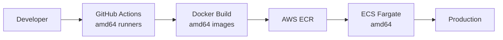
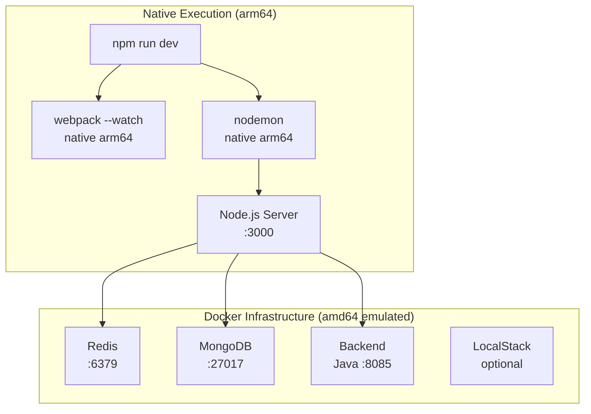

# Platform Architecture & Development Setup

## CDP Platform Architecture

The Core Delivery Platform (CDP) runs on AWS ECS Fargate, which uses **amd64 (x86_64) compute**. All CDP services are deployed as Docker containers built for this architecture.



CDP provides base images (`defradigital/node-development`) published as **amd64 only**, matching their production platform.

## The Apple Silicon Challenge

Apple Silicon Macs use **arm64 architecture**. When running amd64 Docker images on arm64 hosts, Docker uses QEMU to emulate x86_64 instructions:

```
┌─────────────────────────────────────────┐
│  Apple Silicon Mac (arm64)              │
│  ┌───────────────────────────────────┐  │
│  │  Docker Desktop                   │  │
│  │  ┌─────────────────────────────┐  │  │
│  │  │ QEMU Emulation Layer        │  │  │
│  │  │ ┌─────────────────────────┐ │  │  │
│  │  │ │ amd64 Container         │ │  │  │
│  │  │ │ (CDP base image)        │ │  │  │
│  │  │ └─────────────────────────┘ │  │  │
│  │  └─────────────────────────────┘  │  │
│  └───────────────────────────────────┘  │
└─────────────────────────────────────────┘
```

### What Works Under Emulation

✅ **Simple operations:**

- Basic Node.js execution (`node src/index.js`)
- HTTP servers (Hapi.js, Express)
- Pure JavaScript execution (V8)
- Database drivers (MongoDB, Redis clients)

### What Fails Under Emulation

❌ **Complex operations:**

- **Native binaries** (Dart VM in sass-embedded)
- **File watchers** (nodemon, webpack watch mode)
- **Postinstall scripts** (npm lifecycle hooks spawning child processes)
- **JIT compilation** in emulated environments

## Specific Issues Encountered

### Issue 1: npm Postinstall Scripts Hang

**The problem:**

```dockerfile
RUN npm ci  # Hangs on @defra/cdp-auditing postinstall script
```

**Why it happens:**

- `@defra/cdp-auditing` postinstall script sets up Husky (git hooks)
- Under emulation: spawns child processes → QEMU translation → system call mismatch → hang

**Workaround:**

```dockerfile
RUN npm ci --ignore-scripts  # Skip postinstall hooks
```

### Issue 2: Webpack Build Hangs

**The problem:**

```dockerfile
RUN npm run build:frontend  # Silent hang on sass-embedded
```

**Why it happens:**

```
webpack → sass-loader → sass-embedded → Dart VM (x86_64 binary)
                                          ↓
                                    QEMU emulation
                                          ↓
                                  JIT compilation fails
                                          ↓
                                     Silent hang
```

**What we tried:**

- ❌ Build inside Docker → hangs
- ❌ Use nodemon in Docker → segfaults (exit 139)
- ✅ Build on host (native arm64) → works perfectly

### Issue 3: File Watching Crashes

**The problem:**

```dockerfile
CMD ["npm", "run", "docker:dev"]  # nodemon crashes with exit 139
```

**Why it happens:**

- nodemon uses inotify (Linux) or fsevents (macOS) for file watching
- System call translation under emulation → segmentation fault
- Exit code 139 = SIGSEGV (segmentation fault)

**What we tried:**

- ❌ nodemon in Docker → crashes
- ❌ webpack --watch in Docker → hangs
- ✅ Run natively on Mac → stable hot reload

## Our Solution: Hybrid Architecture

We run the frontend **natively** and use Docker only for **infrastructure services**.



### Architecture Decision

**What runs natively (on Mac):**

- ✅ Frontend Node.js server
- ✅ webpack with sass-embedded (native arm64 binaries)
- ✅ nodemon file watching (native OS hooks)
- ✅ Development tools (debugging, hot reload)

**What runs in Docker (emulated):**

- ✅ Redis (simple key-value store, stable under emulation)
- ✅ MongoDB (database engine, stable under emulation)
- ✅ Backend Java service (JVM, stable under emulation)
- ✅ LocalStack (AWS emulation, optional)

### Why This Works

```
Your Mac (native arm64)
├─ Frontend Server (localhost:3000)
│   └─ Connects to localhost:6379 (Redis in Docker)
│   └─ Connects to localhost:8085 (Backend in Docker)
│
└─ Docker (amd64 emulation, simple services only)
    ├─ Redis ✅ (no native binaries)
    ├─ MongoDB ✅ (no complex build steps)
    └─ Backend ✅ (Java bytecode, stable)
```

**Key insight:** We avoid emulation for operations that break (builds, file watching, native binaries) and use it only where it's stable (simple service containers).

## Development Workflow

### Standard Development

```bash
make dev
# 1. docker compose up -d (starts Redis, MongoDB, Backend)
# 2. npm run dev (runs natively with hot reload)
```

**Result:**

- 🚀 Fast native webpack builds (~2s)
- 🔥 Hot reload works perfectly (nodemon + webpack watch)
- 🐛 Native Chrome DevTools debugging
- 🔗 Services connect via localhost

### With AWS Services

```bash
make dev-all
# Adds LocalStack to Docker stack for SQS, S3, SNS testing
```

### Why Not Docker Compose for Everything?

**The limitations:**

| Approach                                   | Result                                     |
| ------------------------------------------ | ------------------------------------------ |
| `docker compose up` with frontend          | ❌ Crashes/hangs (emulation issues)        |
| `npm run dev` only                         | ❌ Missing infrastructure (Redis, Backend) |
| **Hybrid: Docker infra + native frontend** | ✅ **Best of both worlds**                 |

## Comparison with CDP CI/CD

Interestingly, our approach **mirrors CDP's actual build pipeline**:

```yaml
# CDP's GitHub Actions (simplified)
- run: npm ci
- run: npm run build # ← Runs on GitHub's amd64 runner
- run: docker build . # ← Copies pre-built assets
- run: docker push ecr
```

**They don't build inside Docker either.** They build on the runner (host), then copy artifacts into the container. We're doing the same locally.

## Trade-offs

### What We Gain

- ✅ Stable, fast development experience
- ✅ Hot reload works (webpack watch, nodemon)
- ✅ Native debugging tools
- ✅ No platform emulation issues
- ✅ Matches CDP's actual build pattern

### What We Lose

- ❌ Perfect production parity (local != container)
- ❌ Can't test Dockerfile issues locally
- ❌ Need to understand the hybrid setup

### The Pragmatic Choice

**For daily development:** The hybrid approach is superior (fast, stable, productive)

**For deployment verification:** CI/CD builds the actual container (GitHub Actions, amd64)

**For production:** The Dockerfile works fine (ECS Fargate is amd64, no emulation)

## Future-Proofing

**If CDP publishes multi-arch images:**

```bash
docker buildx build \
  --platform linux/amd64,linux/arm64 \
  -t defradigital/node-development:latest \
  --push .
```

Then:

- ✅ Docker Compose "just works" on any platform
- ✅ No emulation needed on Apple Silicon
- ✅ No workarounds required
- ✅ Simpler mental model for developers

Until then, the hybrid approach provides the best developer experience on Apple Silicon while maintaining compatibility with CDP's amd64 production platform.

---

**📖 Related Documentation:**

- [Docker Build Investigation](./docs/DOCKER_BUILD_INVESTIGATION.md) - Deep dive into npm/postinstall issues
- [Webpack Build Investigation](./docs/WEBPACK_BUILD_INVESTIGATION.md) - sass-embedded emulation analysis
