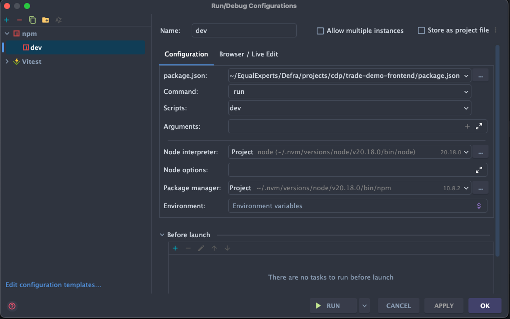

# trade-demo-frontend

[](https://sonarcloud.io/summary/new_code?id=DEFRA_trade-demo-frontend)
[](https://sonarcloud.io/summary/new_code?id=DEFRA_trade-demo-frontend)
[](https://sonarcloud.io/summary/new_code?id=DEFRA_trade-demo-frontend)

---

Node.js/Hapi.js frontend demonstrating CDP platform integration with a Java Spring Boot backend.

**What it demonstrates:**

- DEFRA ID OIDC authentication (OAuth2 + OpenID Connect)
- Direct service-to-service communication with Java backend
- CDP trace ID propagation (x-cdp-request-id)
- Server-side session management (Redis)
- GOV.UK Design System multi-step forms
- CRUD operations with client-side search

## Documentation

- [architecture.md](docs/architecture.md)
- [oauth-oidc.md](docs/oauth-oidc.md)

## Quick Start

### Prerequisites

- Node.js >= v22
- Docker and Docker Compose
- Infrastructure setup: `../trade-demo-local`
- Backend repository: `../trade-demo-backend` (MongoDB) or `../trade-demo-postgres-backend` (
  PostgreSQL)

## Development Workflow

### Local Development

The simplest way to run locally is using the centralized infrastructure:

```bash
# Terminal 1: Start all infrastructure + backend services
cd ../trade-demo-local
docker compose --profile services up -d

# Terminal 2: Start frontend
cd ../trade-demo-frontend
npm install
npm run dev  # Runs on http://localhost:3000
```

**For faster backend development**, start only infrastructure and run backends natively:

```bash
# Terminal 1: Start infrastructure only
cd ../trade-demo-local
docker compose --profile infra up -d

# Terminal 2: Start backend services natively (hot reload)
cd ../trade-demo-backend
mvn spring-boot:run

# Terminal 3: Start commodity codes natively (hot reload)
cd ../trade-commodity-codes
mvn spring-boot:run

# Terminal 4: Start frontend
cd ../trade-demo-frontend
npm run dev
```

**To run the frontend using the Intellij IDE**, so you can debug easily, the details are as below:


The frontend expects:

- Backend at `http://localhost:8085` (override with `BACKEND_API_URL`)
- DEFRA ID stub at `http://localhost:3200` (override with `DEFRA_ID_OIDC_CONFIGURATION_URL`)
- Commodity codes at `http://localhost:8086` (override with `COMMODITY_CODES_API_URL`)

See `../trade-demo-local/README.md` for more infrastructure management options.

### Testing

```bash
npm test              # Run all tests
npm run test:watch    # Watch mode
npm run lint          # Lint JS and SCSS
npm run format        # Auto-fix formatting
```

## Licence

THIS INFORMATION IS LICENSED UNDER THE CONDITIONS OF THE OPEN GOVERNMENT LICENCE found at:

http://www.nationalarchives.gov.uk/doc/open-government-licence/version/3

The following attribution statement MUST be cited in your products and applications when using this
information.

> Contains public sector information licensed under the Open Government license v3

### About the licence

The Open Government Licence (OGL) was developed by the Controller of Her Majesty's Stationery
Office (HMSO) to enable information providers in the public sector to license the use and re-use of
their information under a common open licence.

It is designed to encourage use and re-use of information freely and flexibly, with only a few
conditions.
